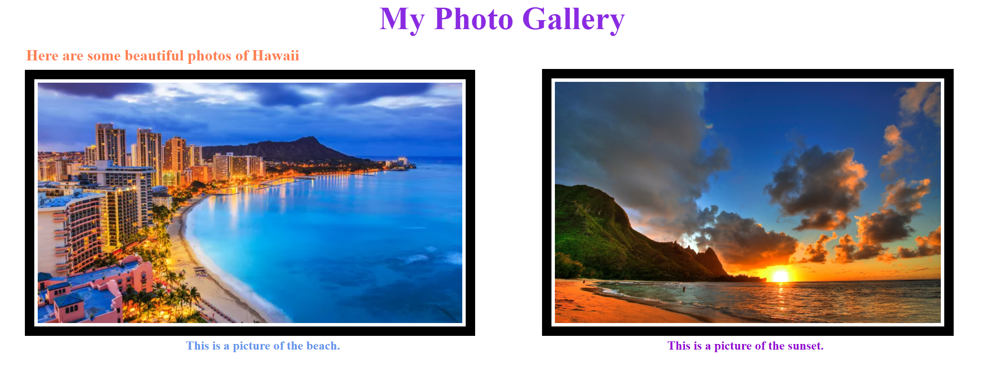

# Make your own Photo-Gallery
Want to show some good photos to others? It can be from online or the photos you take.
# Before you begin
- Please take some time to pick some (at least 2) photos/pictures you like, or you take for this project.
- Make sure photos/pictures are approved by the instructor before you use them. **NO INAPPROPRIATE PHOTOS/PICTURES ALLOWED!**
# Objective
Use CSS box Model to make a photo gallery.
# Set-up your files
Make sure you create the following:
- index.html
- style.css

Create a link tag for your CSS stylesheet in your html document.

 

<b>Here's an example of your final product:</b>

# HTML
1. Before the body, at top of the CSS stylesheet tag, create a header containing the title of your gallery using a `title` tag.
2. In the `body` tag, create a header containing your gallery name using `div id=`tag. Here we are doing header, so you could do `div id=header`.
3. Then create a short description of your gallery by using `h2`tag.
4. Now, you can create one `div`tag.
5. Inside this `div`, you can add your photos by creating `img src=""`tag. Then make sure you use the correct `src` link to the image.
6. After you added the photos/pictures, you can add some descriptions to your photos so people understand it better. Create this using `div id=` tag. 
You can name the id description or something else.
7. If the images are too big, you can also size it by add attribute after the link to image. So you will create `style=""`. You can size the width and height.

# CSS
1. In your CSS, you can first size your header
2. Using `#header` selector to modify the font-size, text-align, color, display and font-weight:
- Set font-size to 50px 
- Set text-align to center (or a different style based on how you like it)
- Set color to the one you like
- Set display to block
- Set font-weight to bold (or another style you like)
3. Using `h2` to modify the description size, position and color:
- Set size to x-large
- Set position to any kind you prefer, try figure out how to place the text on your own
- Change the color of the text if you want
4. Using `img` to add border, margin and padding for the photos:
- Set border to 15px solid black
- Set padding to 5px
- Set margin to 20 px
5. Using `#description`(or the name you give for the `div id=` tag for the description) to modify the position, size and color for it/them:
- Set the position to the style you prefer
- You can set change more style for the description words or leave it as default color

# Stretch
1. Add more pictures and try to use style.css sheet to make pictures with different border style, or general style
- https://www.w3schools.com/css/css3_border_images.asp
- https://www.w3schools.com/css/css3_images.asp
- https://www.w3schools.com/css/css3_borders.asp
2. Change the style of the text, like for header or description
- Text-effect: https://www.w3schools.com/css/css3_text_effects.asp
- Web font: https://www.w3schools.com/css/css3_fonts.asp

# Resources
Adding image: https://www.w3schools.com/tags/att_img_src.asp
Display: https://www.w3schools.com/css/css_display_visibility.asp
Position: https://www.w3schools.com/css/css_positioning.asp

